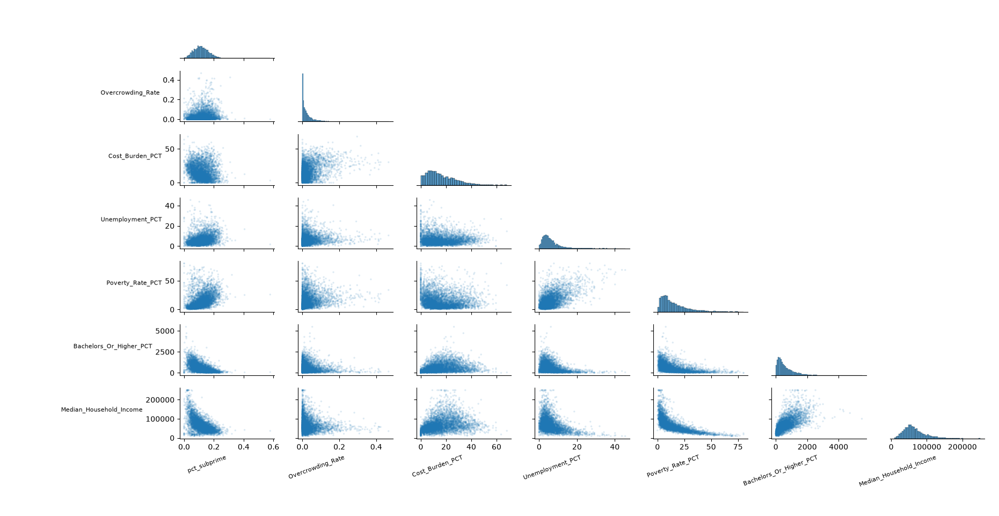
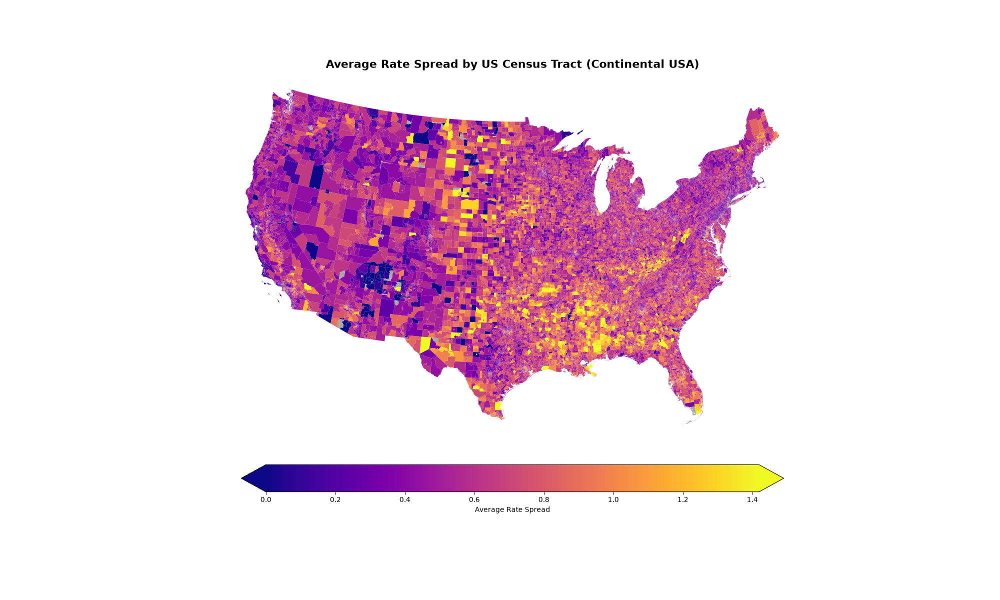

# Long Tail Impacts of Subprime Loans in the Early 2000s

Author -- Matthew Robson  

Advisor -- Aaron Grinberg  

Organization -- Institute of Computing in Research  

## Goal of the Project

Study the long term impacts of the major increases in subprime loans in the early 2000s on the housing market in 2020-2025.

## Methodologies and Data Collection

### Data Collection

For this project we need subprime loan data from the early 2000s (2000 - 2010). For this, we will use the HMDA data set given out by the government. This data set will provide us with most of the information that is needed to classify different regions based on the percentage of subprime loans. To classify loans as subprime we will consider the rate spread and the hoepa_status. The issue here comes from the 2000 to 2003 data which does not have either of these metrics. This is because before 2004 the HMDA did not require information about the rate of the loan so none of that information was collected or stored. In order to identify loans from these periods we will use the HUD subprime lenders list because it is a reliable source of lender that loan out primarily subprime loans and it is the only real metric we have.  
Data will not be stored in the repository as this project has in excess of 40GB of data.

### Data Analysis + Tools

To do the data analysis for this project I will be using Python with the Polars package. Polars has been selected for its high level of performance and ease of use / integration with other tools. There will be some use of other packages such as requests in order to perform some of the API requests for data.

### Data Sources

The data for this project primarily comes from the Housing Mortgage Disclosure Act (HMDA). 
We found data on the years [2000 - 2006] on OPENICPSR:  

[OPENICPSR Data](https://www.openicpsr.org/openicpsr/project/151921/version/V1/view?flag=follow&path=/openicpsr/151921/fcr:versions/V1&type=project&pageSize=50&sortOrder=(?title)&sortAsc=true)

The HMDA data for the years [2007 - 2010] was found on the government's Consumer Financial Protection Bureau:  

[cfpb Data](https://www.consumerfinance.gov/data-research/hmda/historic-data/)

Additional sources were used as primary reading to back up the reliability of the above sources. Notably we considered Ronald Utt's *The Subprime Mortgage Market Collapse: A Primer on the Causes and Possible Solutions*  

[Source](https://www.heritage.org/report/the-subprime-mortgage-market-collapse-primer-the-causes-and-possible-solutions)

Finally, in order to determine the subprime loans made before the additional reporting added to the HMDA in 2004 we used Subprime lender list from the HUD.  

[HUD Subprime Lender Data](https://www.huduser.gov/archives/portal/datasets/manu.html)

As for the housing security data, we used data from the Department of Housing and Urban Development:  

[Housing Estimate Data](https://hudgis-hud.opendata.arcgis.com/datasets/HUD::acs-5yr-housing-estimate-data-by-tract/about)  

[Socioeconomic Estimate Data](https://hudgis-hud.opendata.arcgis.com/datasets/HUD::acs-5yr-socioeconomic-estimate-data-by-tract/about)

[Demographic Data](https://hudgis-hud.opendata.arcgis.com/datasets/HUD::acs-5yr-demographic-estimate-data-by-tract/about)

In order to maintain effective plots we used shape data from IPUMS NHGIS:  

[NHGIS Shape Data](https://data2.nhgis.org/main)

### Improved Data Ingestion

One major issue found in the raw data files as provided above was the inconsistent use of commas and vertical bars as delimiters. To solve this issue, the `CSV_FIXER.py` file was created to swap out the use of vertical bars for commas. Additionally, in the later data files [2007 - 2010], the data set contains each of the elements in quotes. In order to speed up the processing of this data the `removeQuotes.py` file can be run on each of the respective files. Finally, because these files have many rows, it pays to use a schema for each file. Those can be found in the `readLoanData.py` file which allows for the fast reading of the given data files.  

### Data Manipulation

As mentioned above, there was significant work done to work with such a large dataset, but this is not only limited to ingestion. All of the programs used to manipulate data can be found in the `dataManipulation` subfolder of the repository. Through these files we developed multiple levels of compression on the data all the way to the level of `ReducedLoanData/HMDA_Combined.csv` which contains the census-level loan data combined between years [2004 - 2007]. The initial goal of this project was to focus on this shorter time period, so the rest of the data ([2000 2003] U [2008 - 2010]) was excluded completely from the final analysis. This leaves us with the only columns that we care about, GISJOIN (a GIS location specifier), average income, and subprime percentage. The subprime percentage was calculated by taking the total number of loans in a given census tract for each year and combining the subprime loan percentages calculated by year based on a weighted average from the number of loans given each year. This is mathematically equivalent to just finding the percentage of the whole time frame. Finally, no dollar adjustments were made in this compression of years because the use of the average_income column is for purely relative comparisons, and we have no reason to believe that valuation of money changes at different rates in different locations across the US.  

## Graphing & Plotting 

In order to plot in a repeatable and easy-to-understand manner, we used matplotlib. In order to allow for geographical plots, we used GeoPandas, a pandas-based package that has functionality for plotting directly to matplotlib when given spatial data. The `graphs/` folder includes most of the generated images from the plotting. Most of these images were generated at 300 dpi using a 20 by 12 style in mpl. Higher resolution images and other file types were attempted, but this was found to be a good balance of functionality and speed. An SVG image, for example, could be generated, but when created, this file would be over 300MB and was crashing nearly all image editing tools and so is difficult to use.

### Pairplot

This plot demonstrates the correlation between variables. For example, you can see the negative trend between Median Household Income and PCT Subprime in the bottom right corner. This graph was generated from 5,000 sampled points out of the roughly 60,000 census tracts for each plot. The code that generated this plot can be found at `./plotting/pairplot.py`. 

### Subprime Loan Variation by Location 

This plot shows the distribution of subprime loans over the period [2004 - 2007] in the lower 48. Color in the plot represents the percentage of loans considered subprime (rate spread >3%). The code used to generate this graph can be found at `./plotting/plotSubprime.py`.

